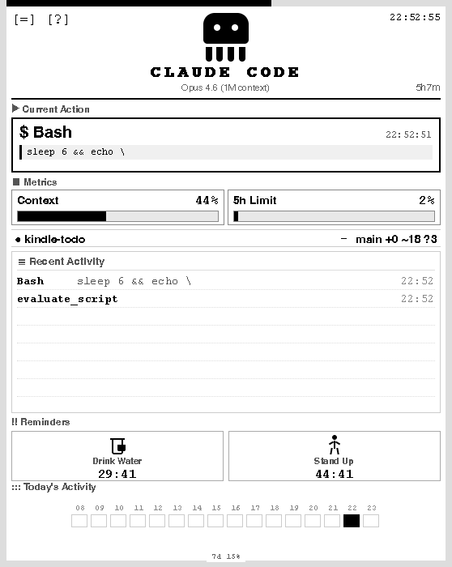
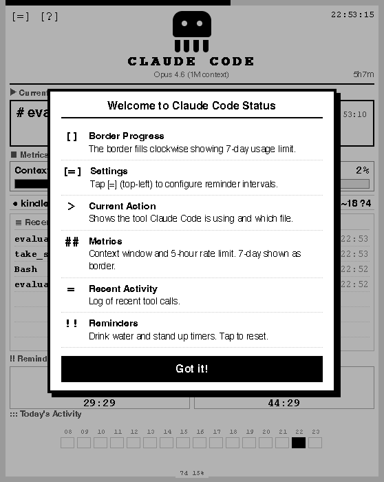
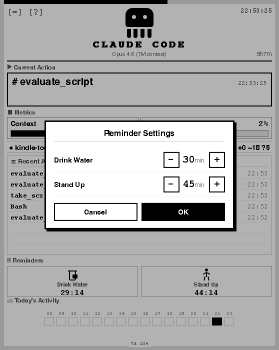
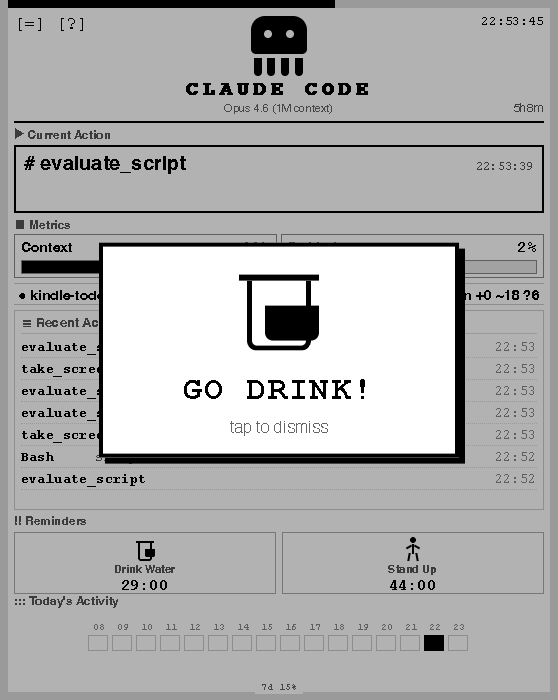
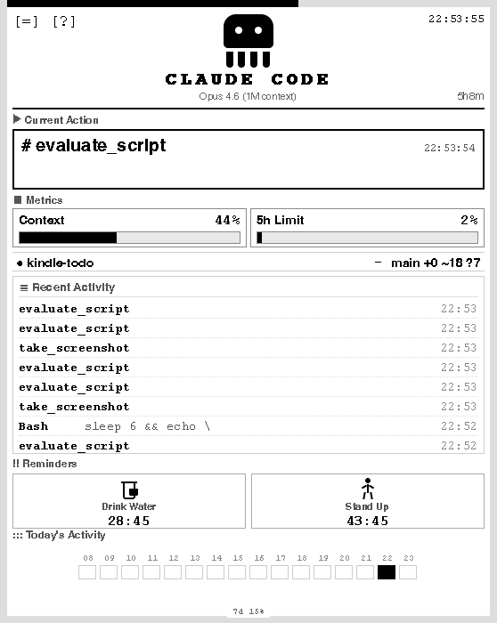

# ClaudeCode Ink HUD

> Turn an old Kindle into a real-time Claude Code heads-up display.
>
> *This is a community project, not affiliated with Anthropic.*

[](https://claudecode-ink-hud.jinstoys.app)

```
               @@
              @@@@
Claude Code ──> localhost:3456 ──> Kindle E-ink
                   (memory)         (LAN poll)
```

**Zero cloud. Zero cost. Zero dependencies. One file.**

---

## Screenshots

<table>
<tr>
<td align="center" width="50%">

<br><b>Dashboard</b>
</td>
<td align="center" width="50%">

<br><b>Welcome Guide</b>
</td>
</tr>
<tr>
<td align="center">

<br><b>Reminder Settings</b>
</td>
<td align="center">

<br><b>Drink Reminder Alert</b>
</td>
</tr>
<tr>
<td align="center" colspan="2">

<br><b>Offline Detection</b>
</td>
</tr>
</table>

---

## Features

| Feature | Description |
|---------|-------------|
| `$>*` **Tool Display** | Real-time tool calls with type prefixes (`$ Bash`, `* Edit`, `> Read`, `@ Agent`) |
| `[##]` **Gauges** | Context window and 5-hour rate limit with visual progress bars |
| `[]` **7d Border** | Page border fills clockwise showing 7-day usage limit |
| `:::` **Heatmap** | Hour-by-hour coding activity visualization (persisted to disk) |
| `!!` **Reminders** | Configurable drink water & stand up timers with full-screen modal alerts |
| `===` **Activity Log** | Last 8 tool calls with file paths and timestamps |
| `---` **Offline Detection** | Dashed border + "last seen Xm ago" when Claude Code is inactive |
| `0.0` **Zero Everything** | No cloud, no database, no npm install. One Bun script on your LAN |

---

## Quick Start

```bash
# Clone and run
git clone https://github.com/DangJin/claudecode-ink-hud.git
cd claudecode-ink-hud
bun server.ts
```

```
╔══════════════════════════════════════════════╗
║  ClaudeCode Ink HUD — Local Server           ║
╠══════════════════════════════════════════════╣
║  Kindle:  http://192.168.x.x:3456            ║
║  Hook:    http://localhost:3456/status        ║
╚══════════════════════════════════════════════╝
```

Then open `http://<your-mac-ip>:3456` on Kindle's browser. Bookmark it.

---

## Setup Claude Code Hooks

Add to `~/.claude/settings.json`:

```json
{
  "hooks": {
    "PreToolUse": [
      {
        "matcher": "",
        "hooks": [{
          "type": "command",
          "command": "/path/to/claudecode-ink-hud/scripts/kindle-hook.sh"
        }]
      }
    ]
  },
  "statusLine": {
    "type": "command",
    "command": "/path/to/claudecode-ink-hud/scripts/kindle-statusline-wrapper.sh"
  }
}
```

> Replace `/path/to/` with your actual project path.

---

## Reminder Settings

Default: 30min water, 45min stand. Customize via URL or tap `[=]` on Kindle:

```
http://192.168.x.x:3456/?water=20&stand=30
```

---

## Architecture

```
Claude Code Hooks                     Kindle Browser
       |                                   |
       | POST /status                      | GET / (HTML page)
       | (tool calls + statusline)         | GET /status (poll 10s)
       v                                   v
  +-------------------------------------------+
  |         Bun HTTP Server (:3456)           |
  |                                           |
  |   state: { tool, file, model, ctx%, ... } |
  |   heatmap: [0,0,...,12,...,0]  (24 slots) |
  |                                           |
  |   POST: localhost only (403 for LAN)      |
  |   GET:  0.0.0.0 (any LAN device)         |
  +-------------------------------------------+
         |
         v
     .data/heatmap.json (persisted daily)
```

---

## Project Structure

```
claudecode-ink-hud/
  server.ts                         # The entire server (single file)
  scripts/
    kindle-hook.sh                  # PreToolUse hook -> POST /status
    kindle-statusline-wrapper.sh    # Statusline wrapper -> POST /status + claude-hud
  .data/
    heatmap.json                    # Daily activity data (auto-created)
```

---

## Requirements

- [Bun](https://bun.sh) runtime
- [jq](https://jqlang.github.io/jq/) (strongly recommended for hook scripts)
- Kindle and Mac on the same WiFi

---

## How It Works

1. **Hook script** runs on every Claude Code tool call, extracts tool name / file / git info, POSTs JSON to `localhost:3456`
2. **Statusline wrapper** intercepts Claude Code's statusline stdin (model, context%, rate limits), POSTs metrics to the same endpoint, then pipes data through to claude-hud
3. **Bun server** merges incoming data into in-memory state, serves an E-ink-optimized HTML page
4. **Kindle browser** polls `/status` every 10 seconds, updates the dashboard with vanilla JS

---

## Security

- **POST** `/status` only accepts requests from `localhost` (hooks run on the same machine)
- **GET** is open to LAN (Kindle needs to read it)
- No authentication needed — the server only runs on your local network
- No data leaves your machine

---

## Links

- **Landing Page:** [claudecode-ink-hud.jinstoys.app](https://claudecode-ink-hud.jinstoys.app)
- **GitHub:** [github.com/DangJin/claudecode-ink-hud](https://github.com/DangJin/claudecode-ink-hud)

---

## License

MIT
